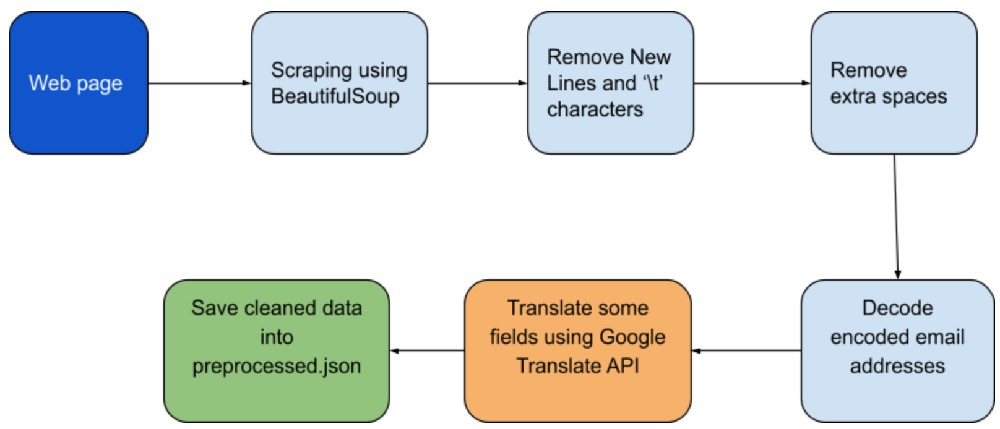

# Sri Lankan Politicians Search
This repository contain source code for Sri Lankan Politicians Search engine created using Python and Elasticsearch

## Directory Structure

The important files and directories of the repository is shown below

    ├── scrape.py : Contains functions used to scrape data and store the scraped data in scraped.txt  
    ├── scraped.txt : data scraped from the [website](http://www.manthri.lk/)                      
    ├── preprocess.py : Contains the functions used to preprocess the scraped data and store the preprocessed data in preprocessed.json
    ├── preprocessed.json : Contains the cleaned data used to build the index
    ├── data_upload.py : Contains functions used to upload data to elasticsearch cluster
    ├── search.py : Contains functions used to map user search phrases and elasticsearch queries        

## Starting the search app

### Starting the elasticsearch cluster

Source codes provided in this repository can be used to interact with the elasticsearch cluster installed locally. 
For more details visit [website](https://www.elastic.co/guide/en/elasticsearch/reference/current/getting-started-install.html)
But you can use their cloud deployments to do the same things. For more details regarding cloud deployments, visit [youtube](https://www.youtube.com/watch?v=CCTgroOcyfM)

Once elasticsearch is install, start elasticsearch cluster on port 9200

## Data fields 

Each Politician instance contains following data fields

1. name: තලතා අතුකෝරල
2 .position: පාර්ලිමේන්තු මන්ත්‍රී
3 .party: සමගි ජන බලවේගය
4 .district: රත්නපුර දිස්ත්‍රික්කය
5 .contact_information: ['452274287', 'atukorale_t@parliament.lk']
6. overall_rank: 24
7. participated_in_parliament: 13
8. related_subjects: ['අයිතිවාසිකම් හා නියෝජනය', 'යුක්තිය, ආරක්ෂාව හා මහජන සාමය', 'අධ්\u200dයාපන', 'ආණ්ඩුකරණ, පරිපාලන හා පාර්ලිමේන්තු කටයුතු', 'ආර්ථික හා මුල්\u200dය']
9. date_of_birth: 1963-05-30
10. gender: ස්ත්‍රී
11. school: ['R/Ferguson උසස් පාසල, රත්නපුර', 'ශාන්ත බිෂොප් විද්\u200dයාලය', 'මියුසියස් විද්\u200dයාලය']
12. first_degree: ශ්‍රී ලංකා නීති විද්‍යාලය, කොළඹ
13. post_grads:
14. terms_in_parliament: 2020-08-20 සිට අද දක්වා
15. biography: තලතා අතුකෝරල මහත්මිය 1963-05-30 දින උපත ලබා ඇත.මෙතුමිය R/Ferguson උසස් පාසල, රත්නපුර ශාන්ත බිෂොප් විද්‍යාලය මියුසියස් විද්‍යාලය යන පාසල්වල අධ්යාපනය ලබා ඇත.තම ප්‍රථම උපාධිය ශ්‍රී ලංකා නීති විද්‍යාලය, කොළඹ ලබාගෙන ඇත.2020-08-20 සිට අද දක්වා සමගි ජන බලවේගය නියෝජනය කරමින් පාර්ලිමේන්තුවේ අසුන් ගෙන සිටී.

## Data Scraping & Preprocessing process

The HTML/XML parsing package BeautifulSoup was used to scrape the web pages during the data scraping process. The captured text was then put via text processing routines. This text processing unit cleans text data before passing it to the Google Translator API for Sinhala translation.

## Search Process

### Indexing and quering

Elasticsearch has been used for creating the index and querying. Standard methods such as multi_match, match_phrase, range and aggregation have been used to support the following queries.
* search_text("කැලණිය ධර්මාලෝක විද්‍යාලය") – simple multi-match query
* phrase_queries("කැලණිය ධර්මාලෝක විද්‍යාලය", "school") – search the given phrase in the given field
* faceted_search("නාලන්දා විද්‍යාලය", ["school", "first_degree", "post_grads", "terms_in_parliament", "biography"]) – search the given search term while prioritizing the given fields
* find_politicians_older_than(85) – gives the list of politicians older than the given number(age)
* count_by_category("district") – gives the distinct categories with politician count
* top_n_politicians(10, "district", "රත්නපුර දිස්ත්‍රික්කය") – gives top n politicians while considering the given filed
